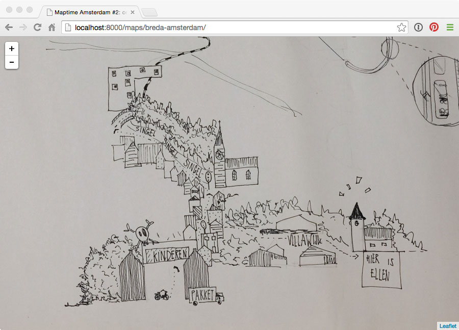

# Maptime Amsterdam #2: one-dimensional maps

During the second edition of Maptime Amsterdam, we worked on hand-drawn _one-dimensional maps_. One-dimensional maps are maps that tell a story - in space or time - along a one-dimensional line. This workshop was inspired by [Laurence Penney's](https://twitter.com/lorp) amazing collection of one-dimensional maps, of which you can see some examples on [Rob Keller's blog](www.youshouldliketypetoo.com/blog/misc/one-dimensional-maps/).

We used [gdal2tiles](http://www.gdal.org/gdal2tiles.html) to create map tiles of the photographed workshop results, as explained in Maptime Amsterdam's [`gdal2tiles-example` repository](https://github.com/maptime-ams/gdal2tiles-example).

Results:

- [Ifrik's map](maps/ifrik)
- [Michiel's map](maps/michiel)
- [Breda-Amsterdam's map](maps/breda-amsterdam)

